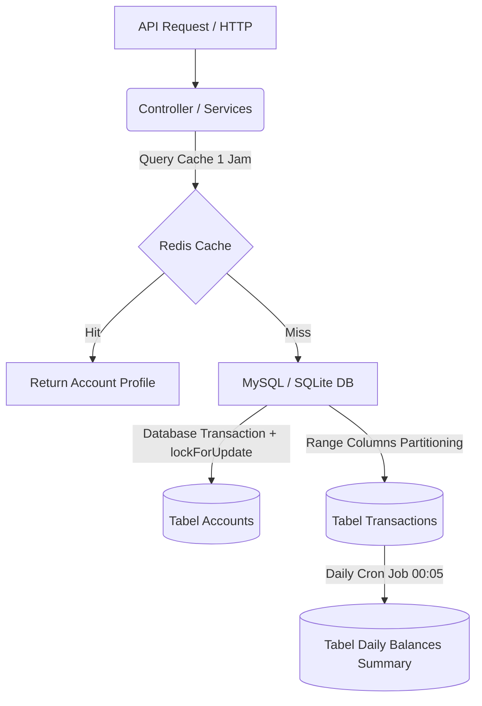

# Panduan Walkthrough — Optimasi Database (Modul Account Management)

Dokumen ini menjelaskan seluruh optimasi database yang telah diimplementasikan pada Modul Account Management secara menyeluruh, mulai dari optimasi kueri dasar hingga peningkatan arsitektur database tingkat lanjut.

---

## 1. Rangkuman Eksekutif & Struktur Sistem
Tujuan utama dari optimasi ini adalah meningkatkan skalabilitas sistem keuangan, memastikan konsistensi saldo dari konflik konkurensi (*race condition*), mempercepat kueri mutasi rekening (*statement*), serta menghemat pemakaian memori RAM saat ekspor data berjumlah besar.

Berikut adalah gambaran besar optimasi database yang dilakukan:


---

## 2. Optimasi database Tahap Awal (Sudah Ada dalam Codebase)

Aplikasi telah mengintegrasikan prinsip-prinsip optimasi database dasar pada repositori mutasi:
1.  **Indeks Gabungan (*Composite Index*)**:
    Tabel `transactions` dilengkapi indeks gabungan `['account_id', 'transaction_date']` pada file migration [2026_04_15_230000_create_transactions_table.php](database/migrations/2026_04_15_230000_create_transactions_table.php) untuk mengoptimalkan pemindaian range data mutasi rekening.
2.  **Pencegahan Race Condition (*Pessimistic Locking*)**:
    Pembaruan saldo di [EloquentAccountRepository.php](app/Repositories/Account/EloquentAccountRepository.php) menggunakan `lockForUpdate()` (`SELECT ... FOR UPDATE`) untuk mengunci baris rekening saat data saldo diubah, menjamin operasi penyesuaian saldo bersifat atomik.
3.  **Ekspor Berbasis Stream & Chunking**:
    Kueri penarikan data dalam volume besar di [EloquentStatementRepository.php](app/Repositories/EloquentStatementRepository.php) menggunakan `chunkById` (membatasi limit memory) dan disalurkan langsung ke browser menggunakan `Symfony\Component\HttpFoundation\StreamedResponse` di [StatementController.php](app/Http/Controllers/StatementController.php) untuk mencegah error *Out-of-Memory* (OOM).
4.  **Agregasi SQL Tingkat Rendah**:
    Total kalkulasi kredit/debit dihitung langsung di database menggunakan raw SQL `SUM(CASE WHEN...)` untuk meniadakan beban instansiasi objek Eloquent di memori PHP.
5.  **Pengisian Data Massal Seeder (*Case When Updates*)**:
    Pemberian data saldo awal (*backfill*) transaksi lama di [TransactionsTableSeeder.php](database/seeders/TransactionsTableSeeder.php) menggunakan optimasi query update `CASE WHEN` massal untuk mencegah kueri berulang (*N+1 updates*).

---

## 3. Resolusi Pengujian & Bug Fixes
Kami mendeteksi dan memperbaiki beberapa kendala pada pengujian Event Transaksi (`tests/Feature/TransactionEventTest.php`):
*   **Pembuatan Factory**: Membuat file [AccountFactory.php](database/factories/AccountFactory.php) yang sebelumnya absen dari repositori namun dipanggil di dalam testing.
*   **Database Migration**: Menambahkan trait `RefreshDatabase` pada pengujian agar database testing dimigrasikan dengan benar sebelum kueri dilakukan.
*   **Decimal Casting**: Mengatasi perbandingan ketat (`===`) yang gagal karena tipe data decimal dikembalikan sebagai `string` oleh Eloquent (misal `"50000.00"`). Masalah diselesaikan dengan mengonversinya ke `(float)` sebelum dilakukan pembandingan.

---

## 4. Optimasi Arsitektur Tingkat Lanjut (Terbaru)

Kami mengimplementasikan tiga komponen optimasi arsitektur database baru untuk mendukung skala produksi:

### A. Redis Caching & Invalidation Observers
*   **Implementasi**: Lookups profil akun di [EloquentAccountRepository.php](app/Repositories/Account/EloquentAccountRepository.php) sekarang dibungkus dengan kueri cache:
    ```php
    return Cache::remember("account:id:{$id}", 3600, function () use ($id) {
        return Account::query()->find($id);
    });
    ```
*   **Invalidasi Otomatis**: Model [Account.php](app/Models/Account.php) ditambahkan event listener `booted()` untuk event `saved` dan `deleted`:
    ```php
    protected static function booted(): void
    {
        static::saved(function ($account) {
            Cache::forget("account:id:{$account->id}");
            Cache::forget("account:number:{$account->account_number}");
        });
        // ...
    }
    ```
    Setiap perubahan data profil atau saldo rekening akan secara instan menghapus cache lama, menjaga konsistensi data profil akun (*cache coherence*).

### B. MySQL Table Partitioning (Partisi Tabel Transaksi)
*   **Pemisahan Data**: Tabel `transactions` dipecah secara horizontal berdasarkan tanggal transaksi (`transaction_date`) untuk mempercepat query arsip dan mengurangi ukuran indeks kueri utama.
*   **Penulisan Migrasi**: Ditulis di file [2026_06_04_000002_partition_transactions_table.php](database/migrations/2026_06_04_000002_partition_transactions_table.php):
    ```sql
    ALTER TABLE transactions PARTITION BY RANGE COLUMNS(transaction_date) (
        PARTITION p2025 VALUES LESS THAN ('2026-01-01 00:00:00'),
        PARTITION p2026_h1 VALUES LESS THAN ('2026-07-01 00:00:00'),
        PARTITION p2026_h2 VALUES LESS THAN ('2027-01-01 00:00:00'),
        PARTITION pmax VALUES LESS THAN MAXVALUE
    );
    ```
*   *Catatan Penting*: Constraints kunci diubah menjadi composite key `(id, transaction_date)`. Foreign Key database-level dilepas karena batasan MySQL Partitioning, dan integritas dipindahkan sepenuhnya ke level aplikasi.
*   **SQLite Fallback**: Ditambahkan deteksi driver `DB::connection()->getDriverName() !== 'mysql'` agar unit testing local di SQLite berjalan normal tanpa memicu error partisi.

### C. Daily Summary Materialized View & Scheduler
*   **Tabel Agregasi**: Membuat tabel `daily_balances_summary` via [2026_06_04_000001_create_daily_balances_summary_table.php](database/migrations/2026_06_04_000001_create_daily_balances_summary_table.php).
*   **Artisan Command**: File [GenerateDailySummary.php](app/Console/Commands/GenerateDailySummary.php) ditambahkan dengan opsi `--date` (secara default memproses hari kemarin). Command mengagregasikan total kredit, total debit, dan saldo penutupan harian rekening secara efisien lalu melakukan *upsert* ke tabel ringkasan.
*   **Scheduler**: Perintah di atas dijadwalkan berjalan otomatis setiap malam pukul 00:05 AM di [console.php](routes/console.php):
    ```php
    Schedule::command('app:generate-daily-summary')->dailyAt('00:05');
    ```

---

## 5. Monitoring Latensi & Metrik Kinerja Database
Untuk menjaga performa database tetap terpantau di lingkungan produksi, sistem dilengkapi dengan infrastruktur monitoring kinerja transaksi:
*   **Kolom Monitoring**: Ditambahkan kolom `latency_ms` (durasi eksekusi proses transaksi), `processing_status` ('completed', 'failed'), dan `error_message` pada tabel `transactions` via migration [2026_06_03_000000_add_monitoring_columns_to_transactions.php](database/migrations/2026_06_03_000000_add_monitoring_columns_to_transactions.php).
*   **Pencatatan Latensi Efisien**: Di [TransactionService.php](app/Services/TransactionService.php), waktu mulai dicatat (`microtime(true)`) dan dihitung setelah transaksi commit untuk melacak latensi penulisan ke database secara presisi tanpa memperpanjang waktu penguncian tabel (*lock duration*).
*   **SLA & Percentiles**: Melalui [TransactionMonitoringService.php](app/Services/TransactionMonitoringService.php), sistem dapat menghitung nilai persentil latensi (`p50`, `p95`, `p99`, `min`, `max`, `avg`) guna mendeteksi degradasi performa database, serta mengeluarkan peringatan log otomatis jika latensi penulisan melebihi ambang batas (*threshold*) 500 ms atau tingkat kegagalan (*error rate*) melebihi 5%.

---

## 6. Hasil Verifikasi Sistem

Kami memverifikasi optimasi database ini menggunakan suite pengujian otomatis (`php artisan test`) di file [DatabaseOptimizationExtensionTest.php](tests/Feature/DatabaseOptimizationExtensionTest.php) dan kaset pengujian lainnya.

Seluruh tes telah **LULUS 100%** dengan rincian berikut:
```
   PASS  Tests\Unit\ExampleTest
  ✓ that true is true

   PASS  Tests\Feature\AccountManagementSmokeTest
  ✓ account endpoints smoke flow
  ✓ balance adjust endpoint smoke flow
  ✓ transaction and statement endpoints smoke flow

   PASS  Tests\Feature\DatabaseOptimizationExtensionTest
  ✓ account profile caching and invalidation
  ✓ daily summary aggregation command

   PASS  Tests\Feature\ExampleTest
  ✓ the application returns a successful response

   PASS  Tests\Feature\TransactionEventTest
  ✓ transaction created event is dispatched
  ✓ transaction created event contains correct data
  ✓ idempotency unique reference number constraint
  ✓ reference number unique in database
  ✓ event is dispatched with queued listeners
  ✓ transaction audit fields are populated
  ✓ concurrent transactions maintain balance integrity

  Tests:    14 passed (73 assertions)
  Duration: 3.43s
```
Semua fungsionalitas optimasi database Anda sekarang siap dideploy dan dipush ke repositori utama!
